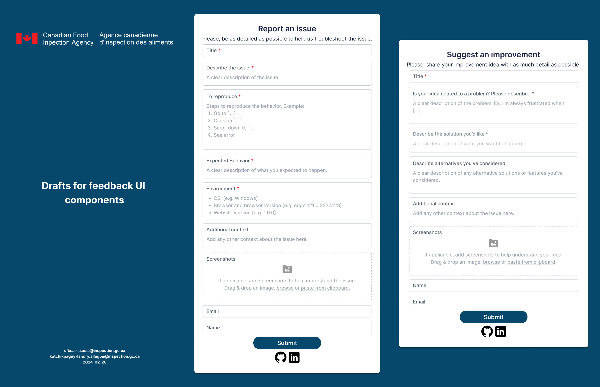
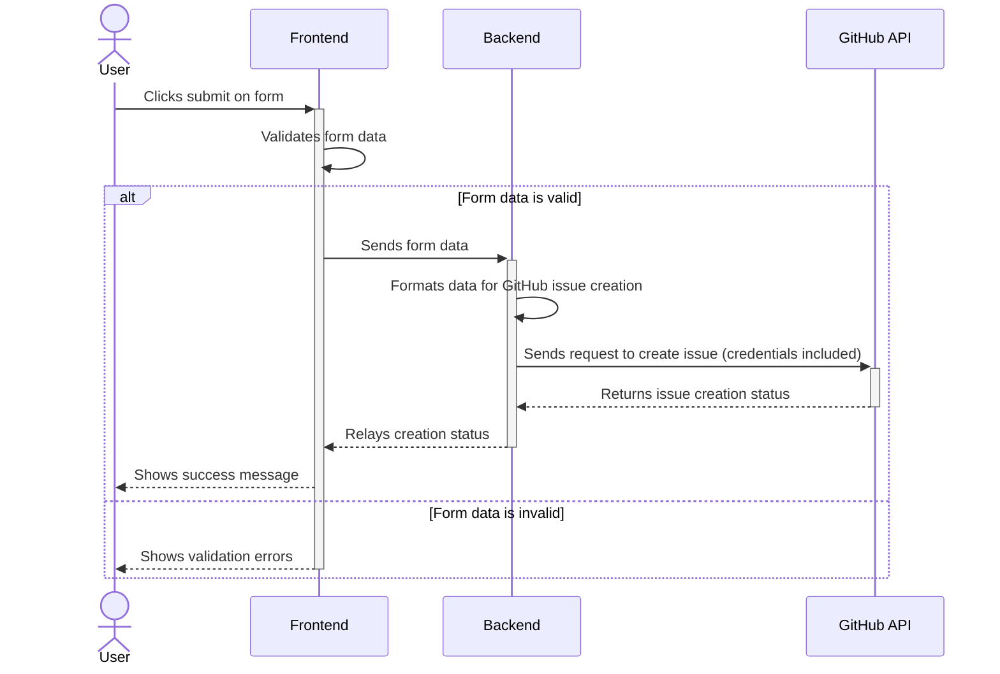
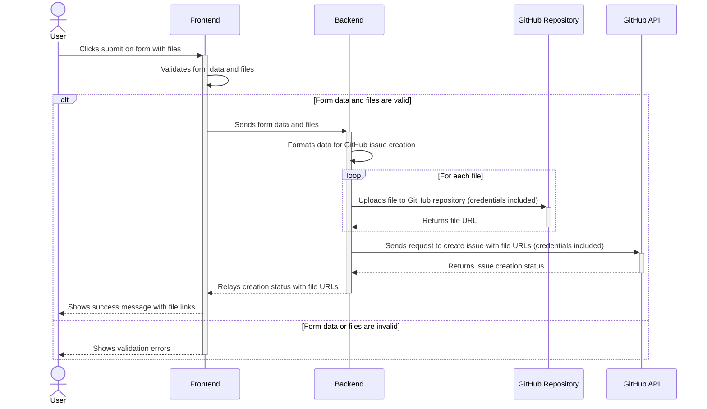

# Feedback UI Design

## Why feedback UIs?

Allow our websites users to quickly report issues or suggest improvements
without needing a GitHub account.

## Alternatives

1. Get feedback directly from users: this may not always be possible as users
   might be in different locations from developers.
2. Email forms: simple and direct, but may not be as organized for tracking the
   issues.
3. Third party UI components: searches for ready-to-use components were
   unfruitful.

## Quality attributes

1. Usability: provide timely feedback on form submission and file upload progress.
2. Reliability: on API failures or file upload issues, retry at least once.
3. Performance:
   - size limit the attachments on a single form submission
   - rate limit submissions to avoid abuse

## UI components draft

## Issue creation without file attachments

Attaching files to a GitHub issue via API doesn't seem straightforward. Read
[this](https://stackoverflow.com/questions/45092776/is-it-possible-to-attach-a-file-to-a-github-issue-via-the-api).
We could work on that later.

## Making the components reusable

This is not so urgent and could also be kept for next sprints. Resources:

- [How we host a React component library on GitHub
  Packages](https://medium.com/nplan/how-we-host-a-react-component-library-on-github-packages-167f0cb1cb9c)
- [How to Create React Component Library and Publish to Private GitHub Package
  Repository](https://medium.com/tri-petch-digital/how-to-create-react-component-library-and-publish-to-private-github-package-repository-3528ba37cb77)

## Issue creation with file attachments: potential solution

This would require the creation of a separate repository to host the attachment
files (images essentially).

